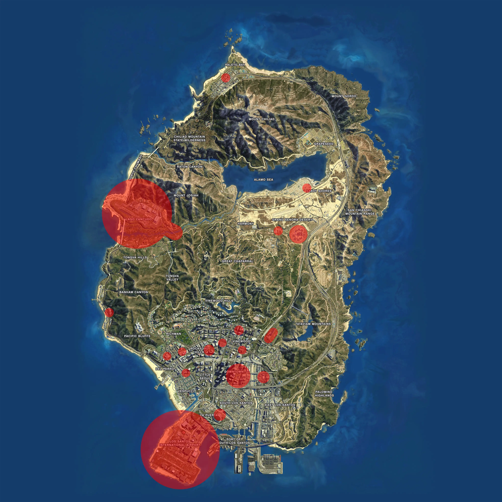

# Risicogebieden binnen Tedeapolis

Tedeapolis kent enkele risicogebieden. In een risicogebied mag preventief gefouilleerd worden. Dus dat wilt zeggen dat ook voertuigen gecontroleerd mogen worden. Hier onder zijn deze gebieden aangegeven.

De korpsleiding is bevoegd om, in samenspraak met de gemeenteraad van Tedeapolis, aanvullende risicogebieden aan te wijzen. Hiervoor gelden dezelfde regels als de normale risicogebieden.

## Kaartweergave

## Postcodes

### Grote Bank

- 7016
- 7017
- 7018
- 7019
- 7012
- 7010

### Burton Bank Vlakbij Tune Shop

- 7032
- 7031
- 7035
- 7033

### Alta Bank Vlakbij Basic Fit

- 7021
- 7003
- 7022
- 7020
- 7059

### Rockford Hills Bank Vlakbij Golfbaan

- 5146
- 5147
- 5148
- 5158
- 5159

### Banham Canyon Bank

- 7066
- 7064
- 7063

### Paleto Bay Bank

- 938
- 909
- 936
- 939

### Grand Senora Bank

- 707
- 706
- 709

### BP Bank / BP

- 3213
- 3212
- 3216
- 3208
- 3210
- 3215
- 3214
- 3216

### ANWB

- 6019

### Car Dealer

- 3212

### Gemeentehuis

- 7041
- 7040

### Ziekenhuis

- 3224 (Uitzondering op de aanhanger garage / buschauffeur depot)

### Pier

- 5041

### Maze bank Arena

- 2200
- 2200-A
- 2200-B

### Parkeerplaats Lombank

- 5152

### Tedeapolis Casino

- 6047
- 6048
- 6049

### Gevangenis

- 702
- 704
- 706
- 707
